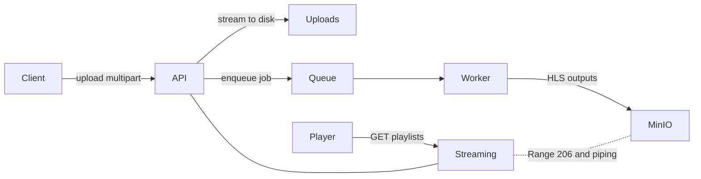

# Video Streaming Server (HLS) with Node, MinIO, FFmpeg and BullMQ



## Snapshot (10s read)
- Upload via stream, no RAM buffering (Busboy + `createWriteStream`)
- Background transcode queue (BullMQ on Redis)
- FFmpeg HLS ladder: 360p, 720p, 1080p
- Assets stored on MinIO (S3-compatible)
- Streaming endpoints support Range (HTTP 206) and direct piping

## Stack
- Node.js + Express
- FFmpeg (installed in the API container)
- BullMQ (Redis)
- MinIO (S3-compatible)

## Quick Start (Docker)
- Create data folders:

```
mkdir storage minio-data
```

- Start services:

```
docker compose up -d --build
```

- MinIO Console: `http://localhost:9001` (`minioadmin`/`minioadmin`)
- Health: `GET http://localhost:3000/health`

## API Endpoints
- Upload: `POST http://localhost:3000/upload` (multipart/form-data, field `file`)
- Playback:
  - `GET http://localhost:3000/videos/:id/hls/master.m3u8`
  - `GET http://localhost:3000/videos/:id/hls/360p.m3u8`
  - `GET http://localhost:3000/videos/:id/hls/720p.m3u8`
  - `GET http://localhost:3000/videos/:id/hls/1080p.m3u8`
  - Segments: `GET http://localhost:3000/videos/:id/hls/<segment.ts>`

## Data Flow
1. Upload: Busboy streams file to disk (`storage/uploads/<id>.mp4`) without buffering
2. Queue: API enqueues job `video-transcode`
3. Worker: spawns `ffmpeg` and produces HLS (m3u8 + ts) into local folder
4. Publish: uploads all HLS files to MinIO under `videos/<id>/hls/*`
5. Stream: API serves playlists/segments by streaming from MinIO, honoring byte ranges

## Technical Details
- Node Streams
  - Upload: `file.pipe(fs.createWriteStream(...))`
  - Streaming: MinIO `getObject` / `getPartialObject` → `stream.pipe(res)`
- Range Headers (HTTP 206)
  - Parse `Range: bytes=start-end`, set `Content-Range`, `Accept-Ranges`, `Content-Length`
  - Partial content returned via `getPartialObject(bucket, key, start, length)`
- FFmpeg HLS Profiles
  - 360p: ~800k video, 96k audio
  - 720p: ~2000k video, 128k audio
  - 1080p: ~5000k video, 192k audio
  - HLS VOD playlists (`hls_time=4`, segment filenames per variant)
- Storage (MinIO)
  - Bucket: `videos`
  - Layout: `videos/<id>/hls/{360p.m3u8,720p.m3u8,1080p.m3u8,*.ts}`
- Master Playlist
  - Served dynamically by API with three variants and bandwidth hints

## Environment Variables
- See `.env.example` for local dev; Docker compose sets these for you
- Core vars: `PORT`, `STORAGE_PATH`, `MINIO_*`, `S3_BUCKET`, `REDIS_URL`

## Ops Notes
- Worker runs within API process for simplicity; in production, run as a separate service
- Switching to MPEG-DASH: adjust FFmpeg command and routes accordingly
- Scaling:
  - Horizontal scale API and Workers; Redis centralizes queue state
  - Use MinIO/S3 for shared storage across replicas
  - Consider CDN in front of `/videos/*` for production delivery

## Test Quickly
- Upload:

```bash
curl -F file=@sample.mp4 http://localhost:3000/upload
```

- Play (once ready):

```bash
curl http://localhost:3000/videos/<id>/hls/master.m3u8
```
